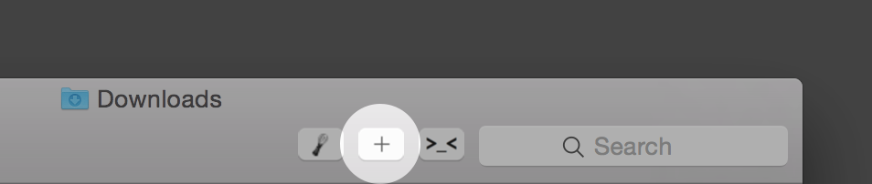

# New File Here

'New File Here' is a miniapp that lives your Finder toolbar and simply creates a new file `untitled.md` in the current folder when clicked.

It's the button on the left:

(the other apps to the right are [Open-in-Sublime](https://github.com/pketh/open-in-sublime) and [Go2Shell](http://zipzapmac.com/Go2Shell).

## Installation

Download the zip, extract, and move the 'new-file-here' app to your Applications folder. Then Command-drag it to your Finder toolbar.
Also included in the zip is the source applescript file that was compiled to build the app

> If you want to edit the icon, the psd is in the repo. Edit it, convert it to icns and assign it to the app. If it's really nice, feel free to send a pull request :)

## Thanks / Credits

The code for this was simply adapted a comment in an ancient [MacWorld article](http://www.macworld.com/article/1151236/createnewfileservice.html).

**Hope you find this as useful as I do!**
